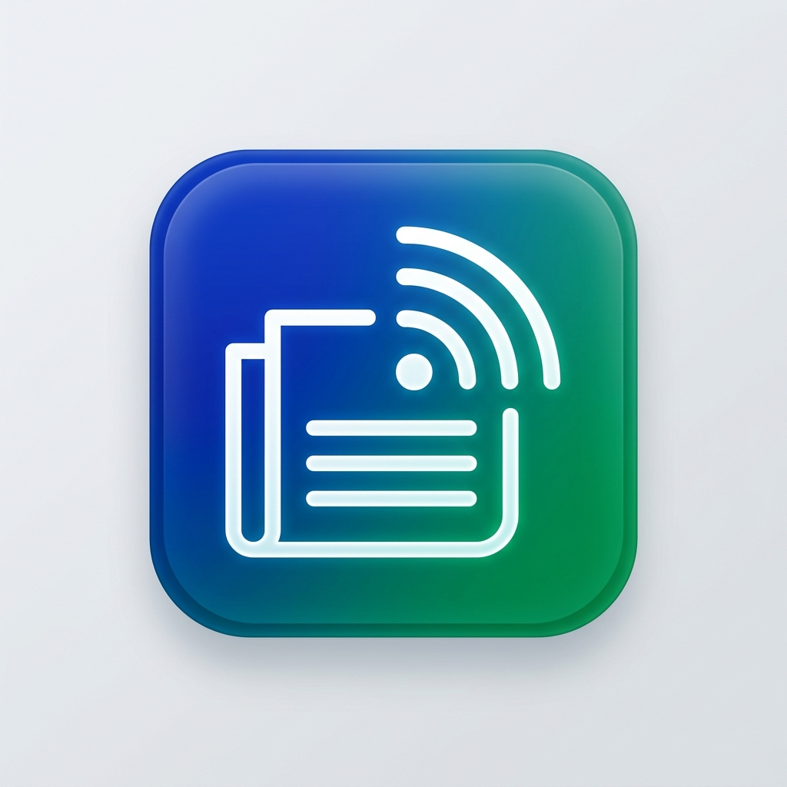

# Gündemim - Yeni Nesil RSS & Haber Okuyucu



Gündemim, modern teknolojilerle (React, Vite, Electron, Capacitor) geliştirilmiş, yapay zeka destekli ve gizlilik odaklı bir haber okuma platformudur. Tüm haber kaynaklarınızı tek bir noktada toplar, gereksiz gürültüden arındırır ve en güncel gelişmeleri saniyeler içinde size sunar.

## 🚀 Öne Çıkan Özellikler

- **Yıldırım Hızı (Turbo V5.1):** 20 paralel worker ile haber çekme süresi %80 daha kısa.
- **Yapay Zeka (AI) Özetleri:** Groq LPU altyapısı ile dünün haberlerini saniyeler içinde analiz eder.
- **Sesli Haber Radyosu:** Kişiselleştirilmiş haber akışınızı sesli bir radyo gibi dinleyin.
- **Güvenli Mimari (V10):** Electron Main-Process fetching ve Sandbox ile tam CORS güvenliği.
- **Cross-Platform:** Windows (Electron) ve Android (Capacitor) desteği.
- **Gizlilik Odaklı:** Tüm verileriniz yerel cihazınızda (IndexedDB) saklanır, buluta gönderilmez.

## 🛠 Teknik Mimari

- **Frontend:** React 19 + Vite 8
- **Desktop Engine:** Electron (Isolated Context & Preload Bridge)
- **Mobile Engine:** Capacitor
- **Database:** Local-first IndexedDB
- **AI Integration:** Groq SDK / API

## 📦 Kurulum ve Geliştirme

### Gereksinimler
- Node.js >= 20
- npm >= 10

### Yerel Çalıştırma
```bash
# Bağımlılıkları yükleyin
npm install

# Geliştirme modunda (React + Electron) başlatın
npm run dev
```

### Derleme
```bash
# Windows için paketle (.exe)
npm run pack-win

# Android için senkronize et
npx cap sync android
```

## 🔒 Güvenlik Notu
Bu uygulama **Electron Security Best Practices** standartlarına uygun şekilde geliştirilmiştir. `nodeIntegration` kapalıdır ve tüm internet istekleri güvenli köprüler üzerinden yönetilir.

## ⚖️ Yasal Bilgilendirme
Gündemim bir içerik üreticisi değildir. Sunulan içerikler, haber kaynaklarının açık RSS servislerinden alınmaktadır. Tüm telif hakları orijinal içerik sahiplerine aittir.

---
**Geliştirici:** [OmerCanInan](https://github.com/OmerCanInan)
